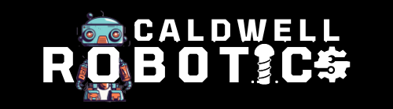

  

# **RoboSoccer**

## Overview

Welcome to the official handbook for **RoboSoccer** The first ever Robotics Event at Caldwell University. Get ready to dive into the exciting world of robotic soccer with this hands-on event designed for technology enthusiasts and aspiring engineers. This page contains all the information you need to participate in or follow the event.

## Table of Contents
- [About the Event](#about-the-event)
- [Materials Provided](#materials-provided)
- [Rules of the Competition](#rules-of-the-competition)
- [Event Schedule](#event-schedule)
- [Updates](#updates)
- [Contact Us](#contact-us)

## About the Event
**RoboSoccer** challenges teams to build and control robots using provided materials to play soccer. This event is a fantastic opportunity for participants to showcase their engineering and programming skills in a friendly yet competitive environment.
Your team will have till april 24th to build your robots and then **Victory or Valhalla!**
  
**Battle Date:** April 24th 2024
**Location:** Student Center Gym
**Time:** 11:00AM to 1:00PM

## Materials Provided
- Arduino Uno
- Jumper Wires
- HC-05 Bluetooth Module
- Motor Driver
- Motors

## Rules of the Competition

### General Rules

1. **Assembly Location and Mentor Accompaniment**: All robots must be assembled at the CogAI Lab located in the library, and team members must be accompanied by their mentors during the assembly process.

2. **Material Restrictions**: No materials are permitted to be taken outside the premises of the lab at any time during the competition.

3. **Responsibility for Damage or Loss**: Teams are fully responsible for any damage or loss incurred to any components provided. In the event of damage or loss, team members may be subjected to fines.

4. **Qualification Criteria**: To qualify for the competition, each team must fulfill the following criteria:
   - At least one team member must attend the final event.
   - A working robot must be completed and presented by the time of the final event.

5. **Optional Additional Components**: Teams have the option to incorporate extra components, beyond those provided, at their own expense.

### General Competition Rules
- At least one team member must be present by 11:00 to qualify for participation.
- Single Elimination Tournament: We will draw for the grouping tomorrow before we start.
- Matches will consist of a basic soccer match played with robots. When a goal is scored, the opposing team will gain possession of the ball. Each match will be 6 minutes long, with a halftime break at the 3-minute mark.
- The competition will feature a league format. Teams will earn points based on their performance in matches, with more points awarded for wins. Winners will be determined based on total points accumulated throughout the league.

## Event Schedule
- We will be updating this as we go closer to the event.

## Updates
Check here for recent updates about the event.

## Contact Us
Email us at  apandey2@caldwell.edu or reach out on our instagram @caldwellrobotics.

