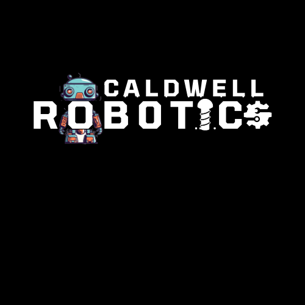

<p align="center">
  
</p>

<p align="center">

# **RoboSoccer**


## Overview

Welcome to the official handbook for **RoboSoccer** The first ever Robotics Event at Caldwell University. Get ready to dive into the exciting world of robotic soccer with this hands-on event designed for technology enthusiasts and aspiring engineers. This page contains all the information you need to participate in or follow the event.


## Table of Contents
- [About the Event](#about-the-event)
- [Materials Provided](#materials-provided)
- [Rules of the Competition](#rules-of-the-competition)
- [Event Schedule](#event-schedule)
- [Code Snippets](#code-snippets)
- [FAQs](#faqs)
- [Registration](#registration)
- [Updates](#updates)
- [Contact Us](#contact-us)

## About the Event
**Date:** April 24th  
**Location:** Caldwell University  
**Time:** [Insert Start Time] to [Insert End Time]

## Materials Provided
- Arduino Uno
- Jumper Wires
- HC-05 Bluetooth Module
- Motor Driver
- Motors

## Rules of the Competition
### General Competition Rules
- Each team can have up to [X] members.
- Robots must fit within the specified dimensions.

### Safety Regulations
- All participants must wear safety glasses during the competition.

## Event Schedule
- 09:00 AM - Registration
- 10:00 AM - Opening Ceremony
- 10:30 AM - Preliminary Rounds
- ...

## Code Snippets
*Code will be updated closer to the event.*

## FAQs
Who can participate?  
How do I register?

## Registration
Click [here](#) to register. Please register by [Insert Deadline].

## Updates
Check here for recent updates about the event.

## Contact Us
Email us at [Insert Contact Email] or reach out on our social media channels.


*Please note that this section will be updated closer to the event with code snippets that can be used or adapted for the competition.*

```cpp
// Sample Arduino code will be provided here
